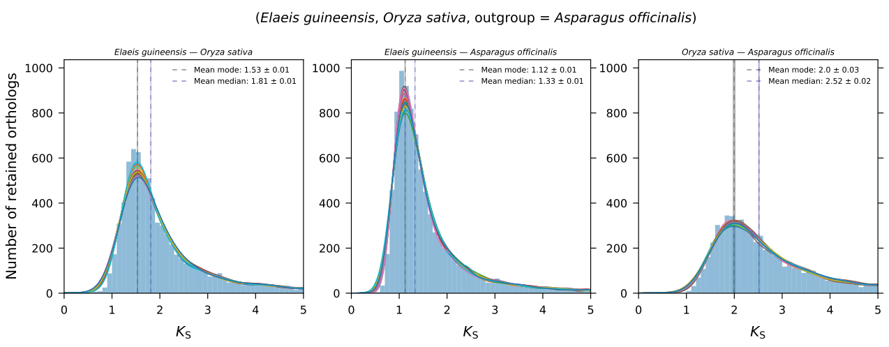

*K*:sub:`S` rate-adjustment
***************************

Substitution rate-adjustment strategy in a nutshell
===================================================

To position ancient whole-genome duplication (WGD) events with respect to speciation events in a phylogeny, it is common practice to superimpose a paralog *K*:sub:`S` distribution for a species of interest with ortholog *K*:sub:`S` distributions between this species and other species, resulting in a mixed paralog--ortholog *K*:sub:`S` plot. 
However, when the lineages involved exhibit different substitution rates, the various *K*:sub:`S` distributions are built on different *K*:sub:`S` scales and a direct comparison among them is likely to mislead the phylogenetic interpretation of WGD signatures or order of divergences.

*ksrates* is an open-source tool offering a rate-adjustment strategy that brings all the distributions to a common *K*:sub:`S` scale by compensating for the differences in synonymous substitution rates relative to the species of interest, the focal species. The final mixed plot produced by *ksrates* features rate-adjusted positions of the ortholog *K*:sub:`S` estimates of species divergence times that help to clarify the phylogenetic placement of WGDs inferred in the focal species.

For more detail about the methodology, please see the related `publication <https://doi.org/10.1093/bioinformatics/btab602>`__.

.. _`explained_example`:

Explained example
=================

In this explained example use case the phylogenetic placement of WGD signatures present in oil palm's (*Elaeis guineensis*) paralog *K*:sub:`S` distribution is studied. This is done in the context of a small monocot phylogeny composed of the focal species (oil palm), *Oryza sativa* (rice) and *Asparagus officinalis* (asparagus) as their outgroup. The input tree in Newick format for this phylogeny is: ``((palm, rice)), asparagus)``. From the evolutionary perspective of oil palm there are two species divergence nodes: palm--rice and palm--asparagus.

The detection of substitution rate differences among lineages and the decomposition of ortholog *K*:sub:`S` mode estimates into branch-specific contributions use methodology similar to relative rate testing and requires the help of an outgroup species.
Therefore, *ksrates* breaks down the input tree into *trios* composed of the focal species, a diverged species and an outgroup species. The input tree in this examples defines only one such trio, ``palm, rice, asparagus``. Here the ortholog *K*:sub:`S` distribution of the palm--rice species divergence (or more specifically, its mode) will be rate-adjusted using asparagus as an outgroup.

.. note ::
    The palm--asparagus divergence has no outgroup in this tree and thus can't be rate adjusted; to be able to do so one would need to extend the phylogeny with one additional species that can function as their outgroup, e.g. *Spirodela polyrhiza*: ``(((palm, rice), asparagus), spirodela)``. 
    By default, if more than one outgroup is available for a species pair, multiple rate-adjustments are performed and the mean among them is taken as consensus. For example, in the extended tree palm--rice would be adjusted both with ``asparagus`` and ``spirodela`` as the outgroup.

The three ortholog *K*:sub:`S` distributions obtained from the ``palm, rice, asparagus`` trio are approximated to their estimated mode with associated standard deviation (Figure 1; for more details please refer to the `Supplementary Materials <https://www.biorxiv.org/content/10.1101/2021.02.28.433234v1.supplementary-material>`__ of our preprint).

    Figure 1: The three ortholog *K*:sub:`S` distributions for the ``palm, rice, asparagus`` trio. Their estimated mean mode is indicated by a black vertical line. A thin colored box ranges from one standard deviation (sd) below to one sd above the mean mode estimate.

Using methodology similar to relative rate testing the ortholog *K*:sub:`S` mode estimate between palm and rice (*K*:sub:`S`\=\1.53) is decomposed into the two branch-specific *K*:sub:`S` contributions: the palm branch contributes a low *K*:sub:`S` of 0.365 while the rice branch contributes a *K*:sub:`S` of 1.17. The considerable difference between them suggests that palm has a much lower synonymous substitution rate than rice.

The ortholog *K*:sub:`S` mode estimate of palm--rice is then rate adjusted by rescaling it to twice the contribution of the palm branch (*K*:sub:`S` --> 2 * 0.365 = 0.73). The position of the (mode) divergence line thus largely shifts towards the left from *K*:sub:`S`\=\1.53 to *K*:sub:`S`\=\0.73 (Figure 2)---it is now rate-adjusted to the *K*:sub:`S` scale of the paralog *K*:sub:`S` distribution of oil palm and shifted to the other side of the second visible WGD peak.
The rate-adjusted mixed plot offers a different interpretation for the phylogenetic placement of the older WGD signature (located at a *K*:sub:`S` of around 0.9) than a naive mixed plot would: instead of suggesting the WGD to be a palm-specific event it is now suggested to be an event shared by both rice and palm. This would be consistent with the previously proposed monocot *tau* WGD event.

.. figure:: _images/mixed_palm_corrected.svg
    :align: center
    :width: 800

    Figure 2: Rate-adjusted mixed paralog--ortholog *K*:sub:`S` plot. The rate-adjusted ortholog *K*:sub:`S` estimate for oil palm and rice (red vertical line) is superimposed on the paralog *K*:sub:`S` distribution of oil palm. The vertical line has been shifted towards the left to the other side of the second WGD peak, as indicated by the red arrow below the plot.
