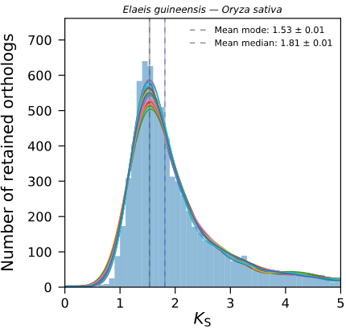

*K*:sub:`S` rate-adjustment
***************************

Substitution rate-adjustment strategy in a nutshell
===================================================

To position ancient WGD events with respect to speciation events in a phylogeny, it is common practice to superimpose a paralog *K*:sub:`S` distribution for a species of interest with ortholog *K*:sub:`S` distributions between this species and other species to obtain a mixed plot. 
However, when the lineages involved exhibit different substitution rates, the *K*:sub:`S` distributions are built on different *K*:sub:`S` scales and a direct comparison among them is likely to mislead the phylogenetic interpretation of WGD signatures or the divergence order.

``ksrates`` is an open-source tool offering a rate-adjustment strategy that brings all the distributions to a common *K*:sub:`S` scale by compensating for the synonymous substitution rate differences relative to one species. The final mixed plot produced by ``ksrates`` features adjustemnts in the position of the ortholog *K*:sub:`S` distributions that help in the clarification of WGD placement in the context of the provided phylogenetic tree.

For more details about the rate-adjustment strategy, see our `preprint <https://www.biorxiv.org/content/10.1101/2021.02.28.433234v1>`__.

.. _`explained_example`:

Explained example
=================

This explained example studies the phylogenetic placement of WGD signatures present in oil palm (*Elaeis guineensis*) paralog *K*:sub:`S` distribution in the context of a small monocots phylogeny composed by the species of interest (oil palm), *Oryza sativa* (rice) and their outgroup *Asparagus officinalis* (asparagus). Such input tree is provided in Newick format: ``((palm, rice)), asparagus)``.
From the perspective of oil palm history there are two divergence nodes (i.e. ortholog *K*:sub:`S` distributions) to be rate-adjusted, namely palm-rice and palm-asparagus.

The detection of substituion rate differences makes use of principles of the relative rate test (REF) and requires therefore an outgroup species.
The pipeline breaks down the tree into *trios* composed by the species pair of a ortholog distribution and the outgroup used for its rate-adjustment. The example tree gives only one trio, "palm, rice, asparagus", where palm-rice divergence will be rate-adjusted with outgroup asparagus.

.. note ::
    Palm-asparagus divergence has no outgroup in this tree and can't be adjusted; to be able to take it into account one should extend the phylogeny with one extra species that can function as their outgroup, e.g. *Spirodela polyrhiza*: ``(((palm, rice), asparagus), spirodela)``. 
    By default, if more than one outgroup is available for a species pair, multiple rate-adjustments are performed and the mean among them is taken as consensus. For example, in the extended tree palm-rice would be adjusted both with ``asparagus`` and ``spirodela`` outgroups.

The three ortholog *K*:sub:`S` distributions obtained from palm-rice-asparagus trio are approximated to their estimated mode (1.53 *K*:sub:`S`) with associated standard deviation (Figure 1; for more details please refer to Supplementary Materials, currently in preprint).

 (0.01 KS).

    The ortholog distribution for palm and rice is approximated to a vertical line passing through its esitmated mode (1.53 *K*:sub:`S`).

Through principles of the relative rate test the ortholog *K*:sub:`S` estimate between palm and rice (1.53 *K*:sub:`S`) is decomposed into the two branch-specific *K*:sub:`S` contributions: palm contributes with 0.365 while rice with 1.17. The difference between them suggests that palm has a much lower substitution rate than rice.

The ortholog *K*:sub:`S` estimate of palm-rice is then adjusted by rescaling it as twice the branch contribution of palm (*K*:sub:`S` --> 0.365 + 0.365 = 0.73). The position of the divergence line results then largely shifted towards left from 1.53 to 0.73 *K*:sub:`S` (Figure 2) and it is now adapted to the slower scale of palm paralog distribution. Interestingy, the rate-adjusted mixed plot offers a new interpretation for the placement of the older WGD signature located around 0.9 *K*:sub:`S`, from being palm-specific to be shared with rice and potentially other monocots.

.. figure:: _images/mixed_palm_corrected.svg
    :align: center
    :width: 800
    :alt: In this figure the mixed plot shows the rate-adjusted ortholog KS distribution for oil palm and rice as a vertical line superimposed to the paralog KS distribution of oil palm. The vertical line has been shifted towards left and has crossed a WGD peak from its right side to its left side, as highlighted by an arrow.

    The ortholog *K*:sub:`S` estimate (red vertical line) has been shifted towards left after rate-adjustment, as highlighted by the red arrows starting from the original position and pointing at the new rate-adjusted position. 

