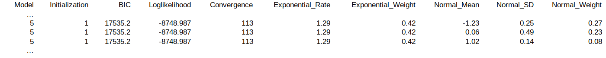
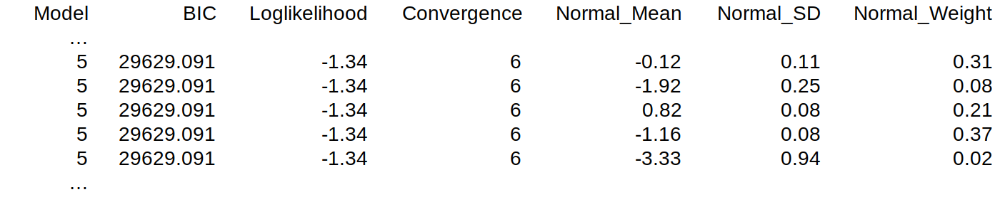

.. _`paralogs_analyses`:

Mixture modeling of paralog *K*:sub:`S` distributions
*****************************************************

The interpretation of mixed paralog–ortholog *K*:sub:`S` distributions is sometimes challenged by the fact that paralog WGD peaks are often not clearly distinguishable due to progressive WGD signal erosion over time and due to potential overlaps between peaks of successive WGDs. In order to more objectively define the *K*:sub:`S` age of WGD peaks, a clustering feature based on mixture modeling has been implemented in *ksrates*.

Three methods are available: anchor *K*:sub:`S` clustering, exponential-lognormal mixture modeling and lognormal-only mixture modeling. A short overview can be found below. For an extended description of these methods, please refer to the `Supplementary Materials <https://www.biorxiv.org/content/10.1101/2021.02.28.433234v1.supplementary-material>`__, currently in preprint.

The analysis configuration determines which are applied and which are not (see also sections :ref:`pipeline_config_section` and :ref:`expert_config_section`).

    * If collinearity analysis is selected in the *ksrates* configuration file (``collinearity`` =  yes), the default method performed is a clustering based on the anchor pair *K*:sub:`S` values in collinear segment pairs. 
    * Otherwise (``collinearity`` = no and ``paranome`` = yes), the default method is exponential-lognormal mixture modeling of the whole-paranome *K*:sub:`S` distribution.
    * Lognormal-only mixture modeling is never applied by default, since it is more prone to produce spurious peaks.

The execution of non-default methods can be triggered in the expert configuration file according to the scheme in the table below. For example, when both collinearity and paranome analyses are selected (last column), only the anchor *K*:sub:`S` clustering is perfomed by default and all the other methods can be optionally triggered.

.. table:: Default methods are marked by a bold capitalized "X", while optional methods are marked by a lower-case "x".

    =======================================  ================  =============  ========================
    Method                                   Colinearity-only  Paranome-only  Collinearity and paranome
    =======================================  ================  =============  ========================
    Anchor *K*:sub:`S` clustering            **X**                            **X**
    Exponential-lognormal mixture model                        **X**          x
    Lognormal mixture model on anchor pairs  x                                x
    Lognormal mixture model on paranome                        x              x
    =======================================  ================  =============  ========================

.. _`anchor_ks_clustering`:

Anchor *K*:sub:`S` clustering
+++++++++++++++++++++++++++++

A clustering approach is used in order to classify anchor pair *K*:sub:`S` values into groups tentatively representing different WGDs in the focal species ancestry. *ksrates* does not cluster the anchor pair *K*:sub:`S` values directly, but instead clusters median *K*:sub:`S` values for the collinear segment pairs, i.e. pairs of sequence regions with conserved gene content and order, that the anchor pairs reside on. Segment pairs originated by the same WGD are likely to share a similar *K*:sub:`S` age and to fall into the same cluster.

The age of each segment-pair is temporarily represented by the median among the *K*:sub:`S` values residing on it.
Such segment-pair medians are then clustered through lognormal mixture modeling. The number of clusters is set equal to the number of whole-genome duplications that can be inferred from the largest block of homologous segments, e.g. 3 WGDs from blocks of 8 segments.
Each median *K*:sub:`S` value is replaced by the original *K*:sub:`S` list for the segment pair in order to obtain the anchor *K*:sub:`S` clusters.
Anchor *K*:sub:`S` clusters for which a link to a real WGD event is ambiguous or unlikely are removed from the dataset, along with the segment pairs defining them (i.e. small, flat or old clusters).

The rate-adjusted ortholog *K*:sub:`S` estimates are finally added in order to obtain a mixed plot to compare the temporal relationship between the inferred WGD peaks and the speciation events.

.. _`elmm`:

Exponential-lognormal mixture model
+++++++++++++++++++++++++++++++++++

*ksrates* implements a custom made exponential-lognormal mixture model (ELMM) algorithm for analyzing whole-paranome *K*:sub:`S` distributions. The exponential component is used to model the L-shaped background *K*:sub:`S` distribution generated by small-scale duplications, while one or more lognormal components are used to model WGD peaks.

Since adequate initialization of the component parameters is crucial for obtaining decent mixture modeling results, *ksrates* uses three different initialization approaches and ultimately chooses the best one based on BIC:

* Data-driven initialization, which infers component parameters from the shape of the *K*:sub:`S` distribution. The exponential component is initialized to match the height of the left boundary of the distribution, while each lognormal component is initialized in correspondence of a peak.

* Initialization with random component parameters, by default with two to five random components.

* Hybrid initialization, where one random lognormal component is added to the data-driven initialized components in the attempt to compensate for possible overlooked signals.

In all three strategies, an extra “buffer” lognormal component is initialized by default at the right boundary of the *K*:sub:`S` range to avoid that other components stretch towards higher values in an attempt to fit the hard-to-fit distribution tail.

The rate-adjusted ortholog *K*:sub:`S` estimates are finally added in order to obtain a mixed plot to compare the temporal relationship between the inferred WGM peaks and the speciation events.

.. warning::
    Please keep in mind that mixture modeling results on *K*:sub:`S` distributions should be interpreted cautiously due to their tendecy of overfitting and overclustering.

Output file format
------------------

Among the output files (for a complete list see section :ref:`output_files`), the ELMM produces a tabular (TSV) file and a text file where to store parameters and fitting results: 

* ``elmm_species_parameters.tsv``:

    * The type of model initialization is stored in column 1 according to a numerical code (1: data-driven, 2: data-driven plus a random lognormal component, 3: random initialization with exponential component and one lognormal component, 4: random initialization with exponential component and two lognormal components; higher numbers feature increasing number of lognormal components).
    * The initialization round is stored in column 2. By default each model type (execpt type 1) is initialized and fitted 10 times, so this column shows numbers from 1 to 10. 
    * The BIC and loglikelihood scores for the fitted model are stored in columns 3 and 4.
    * The number of algorithm iterations needed to reach convergence is stored in column 5. If greater than 300, the convergence is not reached and the cell shows *NA*.
    * The fitted exponential rate parameter and its component weight are stored in columns 6 and 7.
    * The mean, standard deviation and weight of the fitted Normal components used to define the correspondent lognormal components are stored in columns 8 to 10. When there are multiple lognormal components, the data for each of them are stored in a separate row (the number of rows is thus equal to the number of lognormal components).

    This file section shows the result for the first initalization of model 5: each row stores the same data for the exponential component plus the data for one of the three lognromal components.

* ``elmm_species_parameters.txt`` reports the results in a more descriptive and easy-to-read layout.

.. _`lmm`:

Lognormal mixture model
+++++++++++++++++++++++

Logormal mixture modeling (LMM) makes use of only lognormal components and it is optionally available both for whole-paranome and anchor pair *K*:sub:`S` distributions, upon specification in the expert configuration file.

The lognormal components are initialized through k-means and fitted by default with two to five components. For each number of components the mixture model is initialized multiple times and the best fit is chosen according to the largest log-likelihood. Among the resulting four models (one for each number of components), the best fitting model is taken to be the one with the lowest BIC score.

The rate-adjusted ortholog *K*:sub:`S` estimates are finally added in order to obtain a mixed plot to compare the temporal relationship between the inferred WGM peaks and the speciation events.

.. warning::
    Please keep in mind that mixture modeling results on *K*:sub:`S` distributions should be interpreted cautiously due to their tendecy of overfitting and overclustering.
    
    LMM is also more prone than ELMM to detect spurious peaks in the left side of the whole-paranome *K*:sub:`S` distribution because it is less suitable to fit the small-scale duplication background.

Output file format
------------------

Among the output files (for a complete list see section :ref:`output_files`), the LMM produces tabular (TSV) files and text files where to store parameters and fitting results:

* ``lmm_species_parameters_paranome.tsv`` and ``lmm_species_parameters_anchors.tsv``:

    * The Model type is stored in column 1 according to a numerical code (1: one lognormal component, 2: two lognormal components, 3: three lognormal components; and so on).
    * The BIC and loglikelihood scores for the fitted model are stored in columns 2 and 3.
    * The number of algorithm iterations needed to reach convergence is stored in column 4. If greater than 300, the convergence is not reached and the cell shows *NA*.
    * The mean, standard deviation and weight of the fitted Normal components used to define the correspondent lognormal components are stored in columns 5 to 7. When there are multiple lognormal components, the data for each of them are stored in a separate row (the number of rows is thus equal to the number of components).

    This file section shows the result for model 5: each row stores the data for one of the five lognromal components.

* ``lmm_species_parameters_paranome.txt`` and ``lmm_species_parameters_anchors.txt`` collect the model results in a more descriptive and easy-to-read layout.
