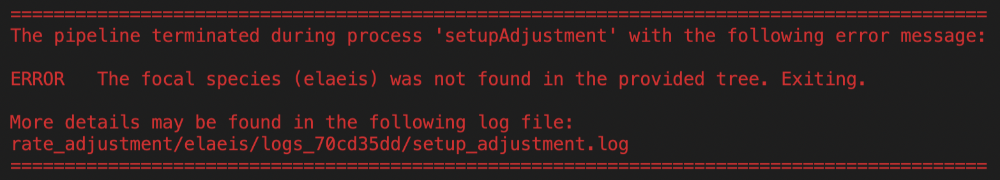
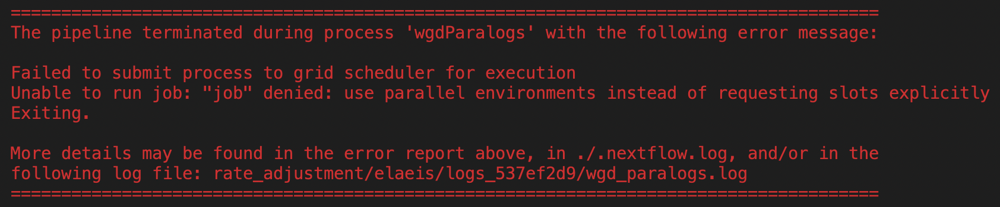

********************
FAQs about *ksrates*
********************

Nextflow
========

If Nextflow crashes, where do I look for the error message?
-----------------------------------------------------------

When Nextflow crashes, an error box appears in the terminal and shows which process stopped the pipeline, the error message lines and points to complete output files. For example:

    Here the error is traced back to the ``setupAdjustment`` Nextflow process and it is due to a wrong setting in the *ksrates* configuration file concerning the input phylogeny.

    
    Here the error is traced back to the ``wgdParalogs`` Nextflow process and it is due to a wrong setting in the Nextflow configuration file concerning communication with the computer cluster.
    
More details about any error that terminated the pipeline can usually be found in log files that are stored in ``rate_adjustment/<focal_species>/log_XXXXXXXX``. The log folder name is unique for each run and is reported on the terminal in the error box and also at the beginning and end of a Nextflow run. The more general Nextflow log file ``.nextflow.log`` in the folder where the pipeline has been launched could also contain additional information.

I am getting a ``failed to reserve page summary memory`` error?
---------------------------------------------------------------

Some cluster configurations may not be fully compatible with certain built-in Nextflow process directives used in the Nextflow configuration file. For example, on some cluster configurations the *ksrates* pipeline fails with a ``failed to reserve page summary memory`` error when using the built-in ``memory`` directive to define how much memory a process requires. In these cases it is likely that instead the ``clusterOptions`` process directive (see the `Nextflow documentation <https://www.nextflow.io/docs/latest/process.html#clusteroptions>`__) needs to be used to define configuration settings specific to your cluster. We advise to contact your cluster administrator about these.

How do I update a previously downloaded *ksrates* pipeline if a new version becomes available?
----------------------------------------------------------------------------------------------
::
   
    nextflow pull VIB-PSB/ksrates

Containers
==========

Containers take up quite some storage space, is this normal?
------------------------------------------------------------

Containers are known to be voluminous, especially Docker ones.

To keep Docker images, containers and volumes under control, you can delete the ones you don’t need anymore by using the following commands:

    * Selectively delete images (``vibpsb/ksrates``)::

        docker image rm [image_ID]

    * Delete all containers/images and networks that are not in use::

        docker system prune -a 

.. TODO: why the vibpsb/ksrates here?
.. TODO: what are networks? is this important here?

To remove an Apptainer container, remove its ``.img`` file. You can also check and clean the Apptainer cache with::

    apptainer cache clean [--dry-run]

.. TODO
.. How to check for updated container versions?
.. --------------------------------------------

General errors and warnings
===========================

The *K*:sub:`S` analysis step seems stuck.
------------------------------------------

*K*:sub:`S` analysis can take up to several hours, depending on the size of the genome, the size of the gene families, available resources, etc., and can look frozen when it doesn't output any of the ongoing operations. The building of the BLAST database and the gene family *K*:sub:`S` analyses can take quite some time. Particularly for paralog *K*:sub:`S` analyses, it can happen that even if the last gene family has been processed the analysis of more complex earlier gene families is still not complete.

What does "No codeml results for gene family [ID]" mean?
--------------------------------------------------------

The Nextflow ``wgd_paralogs.log`` file reports details over the *K*:sub:`S` analysis from the paralog or ortholog gene families. ``No codeml results for gene family [ID]...`` means that no *K*:sub:`S` estimates could be produced for that gene family.

.. TODO
.. No ... clustering/weighting results for..
.. -----------------------------------------

Configuration
=============

How can I change the fit of the KDE line(s) on the paranome and anchor distributions?
-------------------------------------------------------------------------------------

Adjust the ``kde_bandwidth_modifier`` parameter in the expert configuration file (see :ref:`expert_config_section`).
