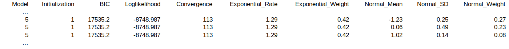
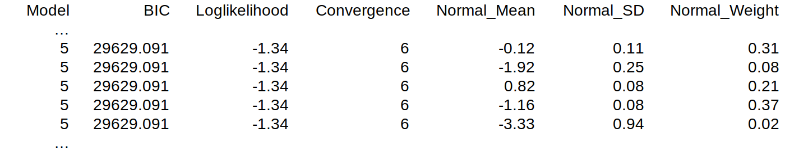

.. _`paralogs_analyses`:

Mixture modeling of paralog *K*:sub:`S` distributions
*****************************************************

The interpretation of mixed paralog–ortholog *K*:sub:`S` distributions can be challenged by the fact that paralog WGD peaks are often not clearly distinguishable due to the progressive WGD signal erosion over time and potential overlapping of multiple peaks from successive WGDs. In order to more objectively define the *K*:sub:`S` age of potential WGD peaks, a clustering feature based on mixture modeling has been implemented in *ksrates*.

Three methods are available: anchor *K*:sub:`S` clustering, exponential-lognormal mixture modeling and lognormal-only mixture modeling. A short overview can be found below. For an extended description of these methods, please refer to the `Supplementary Materials <https://www.biorxiv.org/content/10.1101/2021.02.28.433234v1.supplementary-material>`__ of the preprint.

.. warning::
    Please be aware that mixture modeling results on *K*:sub:`S` distributions should be interpreted cautiously because mixture models tend to overestimate the number of components present in the target *K*:sub:`S` distribution and hence the number of WGDs.

The available methods depend on the *K*:sub:`S` analysis type(s) selected in the *ksrates* :ref:`configuration file <pipeline_config_section>`:

    * When colinearity analysis is requested (``colinearity = yes``), the anchor pair *K*:sub:`S` distribution is analyzed through a clustering based on the anchor pair *K*:sub:`S` values found in colinear segment pairs; lognormal mixture modeling is also optionally available.
    * When paranome analysis is requested (``paranome = yes``), the whole-paranome *K*:sub:`S` distribution is analyzed through exponential-lognormal mixture modeling; lognormal mixture modeling is also optionally available.
    * When reciprocal retention analysis is requested (``reciprocal_retention = yes``) the reciprocally retained *K*:sub:`S` distribution is analyzed through lognormal mixture modeling.

Optional methods are activated through the :ref:`expert configuration file <expert_config_section>` (parameter ``extra_paralogs_analyses_methods``). They follow the scheme illustrated in the table below; for example, when colinearity and paranome analyses are requested (fourth row), by default only the anchor *K*:sub:`S` clustering is performed, while three other methods are optionally available.

.. include:: <isopub.txt>
.. table:: Default methods are marked by |check|, while optional methods are marked by (|check|).

    ===========================================  ==================  ===========  ==========  ===========  ==========
    Analysis setup                               Anchor *K*:sub:`S`  Exp-log MM   Log MM      Log MM       Log MM     
                                                                                                                        
                                                 clustering          paranome     anchors     paranome     rec.ret 
    ===========================================  ==================  ===========  ==========  ===========  ==========
    Colinearity-only                             |check|                          (|check|)                                               
    Paranome-only                                                    |check|                  (|check|)                           
    Reciprocal retention-only                                                                               |check|        
    Colinearity & Paranome                       |check|             (|check|)    (|check|)   (|check|)                           
    Colinearity & Rec.retention                  |check|                          (|check|)                 |check|        
    Paranome & Rec.retention                                         |check|                  (|check|)     |check|        
    Colinearity & Paranome |br| & Rec.retention  |check|             (|check|)    (|check|)   (|check|)     |check|        
    ===========================================  ==================  ===========  ==========  ===========  ==========
.. |br| raw:: html

       

.. _`anchor_ks_clustering`:

Anchor *K*:sub:`S` clustering
+++++++++++++++++++++++++++++

A clustering approach is used in order to classify anchor pair *K*:sub:`S` values into groups that potentially stem from different WGDs in the ancestry of the focal species. The approach does not cluster the anchor pair *K*:sub:`S` values directly, but instead uses lognormal mixture modeling to cluster median *K*:sub:`S` values for the collinear segment pairs, i.e. pairs of sequence regions with conserved gene content and order, that the anchor pairs reside on. Segment pairs originated by the same WGD are likely to share a similar *K*:sub:`S` age and to fall into the same cluster.

Such segment-pair medians are then clustered through lognormal mixture modeling. In order to obtain the clusters of the original anchor *K*:sub:`S` data, each median *K*:sub:`S` value is replaced by the *K*:sub:`S` list of the segment pair.
Anchor *K*:sub:`S` clusters for which a link to a real WGD event is ambiguous or unlikely are removed from the dataset (i.e. small, flat or old clusters).

.. _`elmm`:

Exponential-lognormal mixture model
+++++++++++++++++++++++++++++++++++

*ksrates* implements a custom exponential-lognormal mixture model (ELMM) algorithm for analyzing whole-paranome *K*:sub:`S` distributions. The exponential component is used to model the L-shaped background of a whole-paranome *K*:sub:`S` distribution generated by small-scale duplications, while one or more lognormal components are used to model potential WGD peaks.

Since adequate initialization of the component parameters is crucial for obtaining decent mixture modeling results, *ksrates* uses three different initialization approaches and ultimately chooses the best one based on the 
Bayesian Information Criterion (BIC):

* Data-driven initialization, which infers component parameters from the shape of the *K*:sub:`S` distribution. The exponential component is initialized to match the height of the left boundary of the distribution, while each lognormal component is initialized in correspondence of a peak.

* Initialization with random component parameters, by default with two to five random components.

* Hybrid initialization, where one random lognormal component is added to the data-driven initialized components in the attempt to compensate for possible overlooked signals.

In all three strategies, an extra “buffer” lognormal component is initialized by default at the right boundary of the *K*:sub:`S` range to avoid that other components stretch towards higher values in an attempt to fit the hard-to-fit distribution tail.

Data output file format
-----------------------

Among its outputs (for a complete list see section :ref:`output_files`), the ELMM produces a tabular (TSV) file and a text file where parameters and fitting results are stored: 

* ``elmm_species_parameters.tsv``:

    * The model initialization approach is stored in column 1 ``Model`` according to a numerical code (1: data-driven, 2: hybrid data-driven plus a random lognormal component, 3: random initialization with exponential component and one lognormal component, 4: random initialization with exponential component and two lognormal components; higher numbers feature random initialization with exponential component and increasing number of lognormal components).
    * The initialization round is stored in column 2 ``Initialization``. By default each model type (except type 1) is initialized and fitted 10 times, so this column shows numbers from 1 to 10. 
    * The BIC and loglikelihood scores for the fitted model are stored in columns 3 ``BIC`` and 4 ``Loglikelihood``.
    * The number of algorithm iterations needed to reach convergence is stored in column 5 ``Convergence``. If greater than (by default) 600 iterations would be needed, convergence is not reached and the cell will show *NA*.
    * The fitted exponential rate parameter and its component weight are stored in columns 6 ``Exponential_Rate`` and 7 ``Exponential_Weight``.
    * The mean, standard deviation and weight of the fitted Normal components used to define the correspondent lognormal components are stored in columns 8 to 10: ``Normal_Mean``, ``Normal_SD`` and ``Normal_Weight``. When there are multiple lognormal components, the data for each of them are stored in a separate row (the number of rows for each model and initialization is thus equal to the number of lognormal components).

    This file section shows the result for the first initalization of model 5: each row stores the same data for the exponential component plus the data for one of the three lognormal components.

* ``elmm_species_parameters.txt`` reports the results in a more descriptive and easy-to-read logging format.

.. _`lmm`:

Lognormal mixture model
+++++++++++++++++++++++

Logormal mixture modeling (LMM) makes use of only lognormal components and is available for whole-paranome, anchor pair and reciprocally retained *K*:sub:`S` distributions.

The lognormal components are initialized through k-means and fitted by default with two to five components. For each number of components the mixture model is initialized multiple times and the best fit is chosen according to the largest log-likelihood. Among the resulting four models (one for each number of components), the best fitting model is taken to be the one with the lowest BIC score.

.. warning::
    LMM is more prone than ELMM to detect spurious peaks in the left side of the whole-paranome *K*:sub:`S` distribution because it is less suitable to fit the small-scale duplication background.

Data output file format
-----------------------

Among its outputs (for a complete list see section :ref:`output_files`), the LMM produces tabular (TSV) files and text files where parameters and fitting results are stored:

* ``lmm_species_parameters.tsv`` for whole-paranome, anchor pairs and/or reciprocally retained paralogs:

    * The model type is stored in column 1 ``Model`` according to a numerical code (1: one lognormal component, 2: two lognormal components, 3: three lognormal components; and so on).
    * The BIC and loglikelihood scores for the fitted model are stored in columns 2 ``BIC`` and 3 ``Loglikelihood``
    * The number of algorithm iterations needed to reach convergence is stored in column 4 ``Convergence``. If greater than (by default) 600 iterations would be needed, convergence is not reached and the cell will show *NA*.
    * The mean, standard deviation and weight of the fitted Normal components used to define the correspondent lognormal components are stored in columns 5 to 7: ``Normal_Mean``, ``Normal_SD`` and ``Normal_Weight``. When there are multiple lognormal components, the data for each of them are stored in a separate row (the number of rows per model is thus equal to the number of components).

    This file section shows the result for model 5: each row stores the data for one of the five lognormal components.

* ``lmm_species_parameters.txt`` collects the model results in a more descriptive and easy-to-read TXT logging format; it is generated for whole-paranome, anchor pairs and/or reciprocally retained paralogs.
