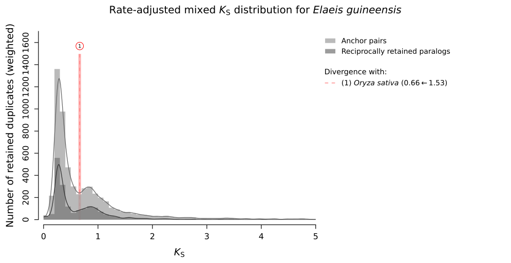

.. _`reciprocal_retention`:

Reciprocally retained gene families for plant WGMs
**************************************************

Concept
=======

As from *ksrates* v2.0.0, an additional *K*:sub:`S` analysis type called ``reciprocal_retention`` and specifically targeting plants has been introduced alongside the existing ``paranome`` and ``colinearity``.

This pipeline implements the construction of paralog *K*:sub:`S` distributions on the basis of plant gene families known to undergo preferential expansion via whole-genome duplication (WGD), rather than small-scale duplication (SSD), followed by retention in duplicate.
This "reciprocal retention" pattern is hypothesized to stem from dosage balance constraints.
By targeting gene families known to expand in this manner, the analysis aims to mitigate the noise from SSDs and accentuate the signal of WGD peaks, analogously to what achieved with the construction of anchor pair *K*:sub:`S` distributions.

A detailed explanation about the reciprocal retention pattern and the implementation of this method in *ksrates* is available in our preprint on `bioRxiv <https://doi.org/10.1101/2025.04.18.649489>`__.

    Figure 1: Rate-adjusted mixed paralog--ortholog *K*:sub:`S` plot for oil palm, showing anchor pair *K*:sub:`S` distribution (light gray) and reciprocally retained *K*:sub:`S` distribution (dark gray). Both distribution types reduces the SSD background and define two WGM peaks.

This method is able to provide precise and narrow peak signals for recent WGMs, and distinguishable peak signals for old WGMs (e.g. Eudicot gamma triplication), offering an additional resource in the toolbox of WGM inference.

Compared to the anchor pairs, leveraging the reciprocal retention pattern doesn't require any genome structural annotation (GFF file) and makes the search for *K*:sub:`S` values less susceptible to genome fragmentation and rearrangements. Nevertheless, since this particular expansion pattern looses its strength over long evolutionary time due to dosage balance compensation mechanisms, the inference of ancient WGMs remains challenging. Moreover, the limited pool of available reciprocally retained gene families (hundreds, up to few thousands) can produce less populated *K*:sub:`S` distributions, depending on the species.

Reciprocal retention pipeline
=============================

In `Li et al. (2016) <https://doi.org/10.1105/tpc.15.00877>`__, the analysis of a dataset of 37 angiosperm species provided 9178 core-angiosperms gene families (orthogroups); later, in `Tasdighian et al. (2017) <https://doi.org/10.1105/tpc.17.00313>`__, these gene families were ranked based on the strength of their reciprocal retention pattern, employing birth-death stochastic modeling on their gene count data.
In *ksrates*, we utilize the set of gene families spanning up to the top 2000th position in this ranking in order to collect a sufficient amount of *K*:sub:`S` values without reintroducing too much of the SSD background.

.. warning::
    It follows that this method is not applicable to taxonomic groups other than plants. Furthermore, as the set of reciprocally retained gene families has been derived solely from angiosperms, its suitability for non-angiosperm plants might also be debated.

The process of obtaining reciprocally retained gene families for the focal species involves reconstructing them from scratch using a clustering algorithm, encompassing the following steps (for comprehensive details, please consult our preprint's Methods section):

.. note ::
    If running the pipeline *outside* the container, make sure your :ref:`manual *ksrates* installation <manual_installation>` included the step downloading file ``original_angiosperm_sequences.tar.gz``.

#. Homology search: execute diamond on the merged sequences from the focal species' FASTA file and the FASTA files originally used for the 37 angiosperms in Li et al. (2016)
#. Gene family clustering: execute OrthoMCL on the generated diamond table
#. Matching gene families: match the original top 2000 gene families in the ranking to the newly generated OrthoMCL families, based on shared gene IDs from the 37 angiosperms. Note that an original gene family may match multiple new gene families.
#. Retaining good matches: keep only the well-matched gene families, i.e. those introducing zero or few extra genes belonging to the 37 angiosperms;
#. Reconstructing gene families: in case of multiple well-matched gene families, merge them to reconstruct the top gene family
#. Extracting focal species' genes: discard all but the focal species' genes and retain only gene families including at least two focal genes, which is the minimum required for *K*:sub:`S` estimate

Runtime, memory and space usage
===============================

Compared to the ``paranome`` or ``collinearity`` analyses, the ``reciprocal_retention`` pipeline requires longer runtime (about a day), larger memory usage during execution (about 40 GB) and larger writing space for temporary output files (at least 50 GB).
It is therefore recommended to check the space availability on disk in advance, execute the pipeline on a compute cluster with parallelization and remove heavy temporary files after completion.

.. note::
    Users may want to initially run only the whole-paranome and anchor pairs analyses in order to obtain prompter results; the reciprocal retention analysis can be activated in a subsequent run by setting ``reciprocal_retention = yes`` in the *ksrates* configuration file.

The diamond step, taking as input tens of angiosperm FASTA files (focal species plus 37 angosperms), generates an output file of 21 GB. This file can be deleted once the reciprocal retention pipeline is completed. The file location for the ``example`` dataset is ``example/paralog_distributions/wgd_elaeis/reciprocal_retention/orthomcl/elaeis_original_37.dmd.tsv``.

The OrthoMCL step, taking as input the diamond table, generates within the ``tmp`` subdirectory the "blast parse output" (BPO) output file, which occupies the same space as the diamond table (i.e. 21 GB). This file can be deleted once the reciprocal retention pipeline is completed. The file location for the ``example`` dataset is ``example/paralog_distributions/wgd_elaeis/reciprocal_retention/orthomcl/May_16/tmp/all.bpo``.

Note on OrthoMCL implementation
===============================

OrthoMCL v1.4 was chosen over other tools (e.g. OrthoFinder) to be consistent with the software choice made in the original publication that generated the core-angiosperm gene families (Li et al., 2016). We however make use of an edited version, called `OrthoMCLight <https://github.com/VIB-PSB/OrthoMCLight>`__, where a few optimizations have reduced memory requirement from 100 GB to 40 GB and the runtime from several days to about a day. This was achieved by changing the following:

- The ``blast_parse`` subroutine avoids loading the entire diamond table into memory and instead processes it line by line;
- Multi-threading is supported in the MCL step

Both OrthoMCL mode 3 and 4 are available. Mode 3 is always performed at first execution of the reciprocal retention analysis and by default also from the second execution on: it takes as input the diamond homology table, it parses it into a "blast parse output" (BPO) format typical of OrthoMCL v1.4 and finally runs MCL. Mode 4 instead accepts directly the parsed table file and then runs MCL; if the parsed table has already been generated in a previous *ksrates* run, the user can provide its filepath through option ``--parsed-homology-table`` when running command ``paralogs-ks``.

Compatibility with the original OrthoMCL v1.4 software is supported through the expert configuration file (``use_original_orthomcl_version``).

Feedback
========

For any question or feedback concerning output, user experience and implementation of the ``reciprocal_retention`` pipeline, feel free to reach out on our GitHub `VIB-PSB/ksrates <https://github.com/VIB-PSB/ksrates>`__ repository.